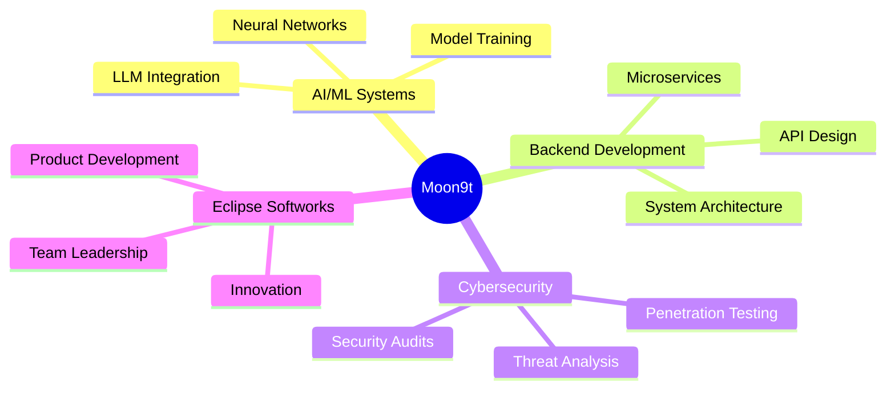

# 🌑 Moon9t

<div align="center">
  
  

</div>

## About Me

```typescript
const moon9t = {
    role: "Founder @ Eclipse Softworks",
    location: "South Africa 🇿🇦",
    expertise: ["AI/ML Systems", "Backend Architecture", "Cybersecurity"],
    philosophy: "Nothing but my brain as weapon ",
    currentFocus: "Pushing boundaries and breaking limits",
    askMeAbout: ["Backend Systems", "AI/ML", "System Design", "Security"]
};
```

---

## Developer Dashboard

<div align="center">

[](https://github.com/Moon9t)
[](https://github.com/Moon9t)

</div>

<div align="center">
  
</div>

---

## Tech Arsenal

### Languages
<p align="center">
  
</p>

### Frontend & Design
<p align="center">
  
</p>

### Backend & Databases
<p align="center">
  
</p>

### AI/ML & Data Science
<p align="center">
  
  
  
</p>

### DevOps & Cloud
<p align="center">
  
</p>

---

## GitHub Analytics

<div align="center">
  
  
</div>

<div align="center">
  
</div>

---

## GitHub Trophies

<div align="center">
  
</div>

---

## Contribution Graph

<div align="center">
  
</div>

---

## 💻 This Week's Coding Activity

<!--START_SECTION:waka-->
<!--END_SECTION:waka-->

<div align="center">
  
</div>

---

## Contribution Snake

<div align="center">
  <picture>
    <source media="(prefers-color-scheme: dark)" srcset="https://raw.githubusercontent.com/Moon9t/Moon9t/output/github-contribution-grid-snake-dark.svg">
    <source media="(prefers-color-scheme: light)" srcset="https://raw.githubusercontent.com/Moon9t/Moon9t/output/github-contribution-grid-snake.svg">
    
  </picture>
</div>

---

## Current Focus



---

## Connect With Me

<div align="center">
  
[](https://github.com/Moon9t)
[](https://linkedin.com/in/moon9t)
[](https://twitter.com/moon9t)
[](mailto:contact@moon9t.dev)

</div>

---

<div align="center">
  
  ### Random Dev Quote
  
  
  ### Fun Fact
  

</div>

---

<div align="center">
  
</div>

<div align="center">
  
  **"Nothing but my brain as weapon."**
  
  

</div>
